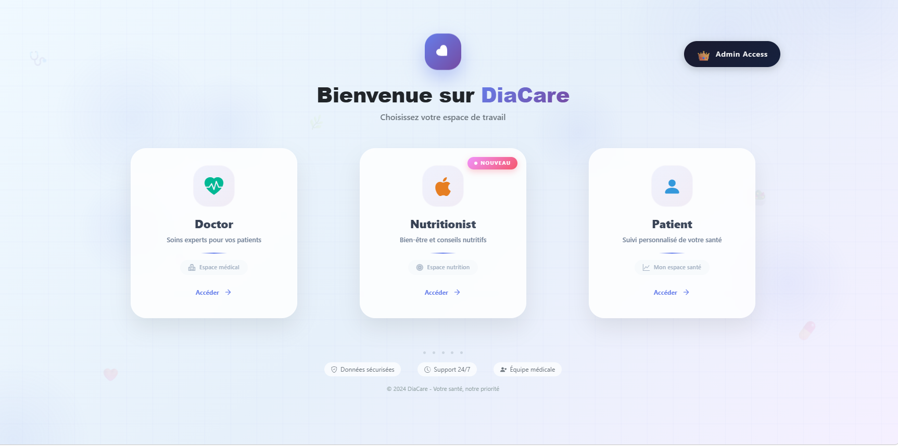
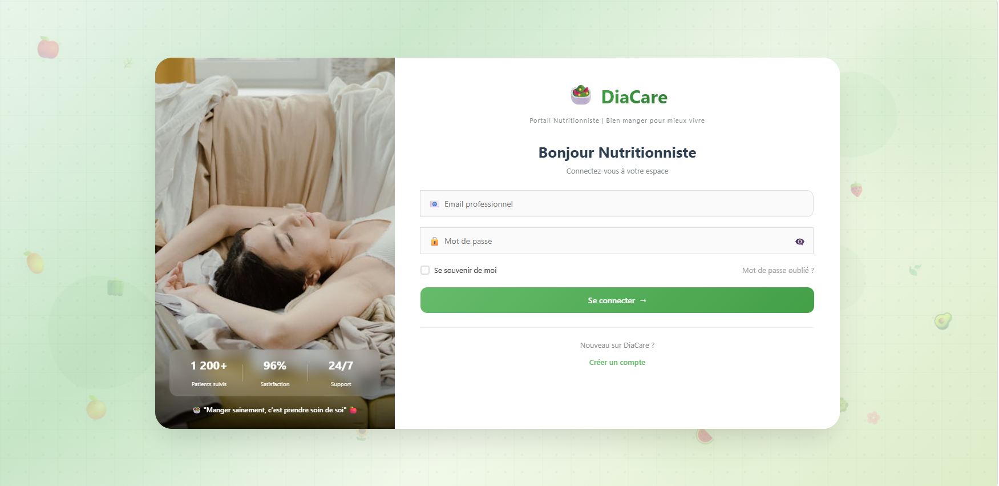
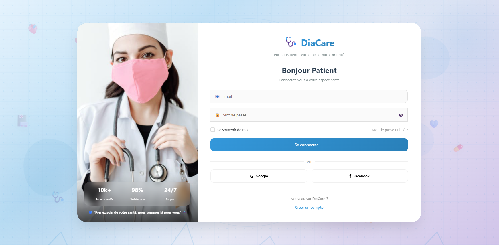
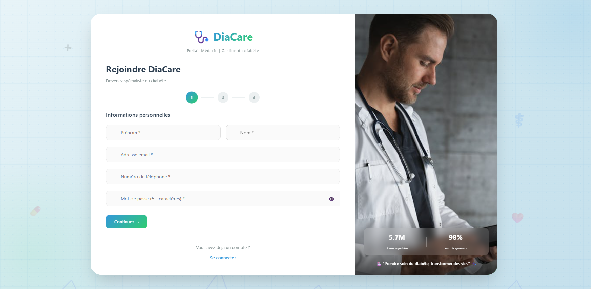

# 💻 DiaCare Frontend - Authentication UI

## 📌 Project Overview

This repository contains the frontend implementation of the **DiaCare platform authentication system**, built with Angular.

It provides a modern UI for multi-role authentication and account activation.

---

## 🚀 Features

### 🔐 Authentication System
- Signup & Login forms
- Multi-role support:
  - Admin
  - Patient
  - Doctor
  - Nutritionist

---

### 📧 Email Activation
- Account activation via email link
- Displays success and error messages
- Secure activation workflow

---

### 👨‍⚕️ Doctor & Nutritionist Registration
- Upload medical certificate (PDF/Image)
- Form validation
- Pending approval by admin

---

### 🧾 Form Validation
- Reactive Forms
- Field validation (email, password, required fields)
- Error handling and user feedback

---

### 🔗 Backend Integration
- REST API integration with Spring Boot backend
- Handles:
  - Authentication requests
  - File upload (multipart/form-data)
  - Activation responses

---

## 🛠️ Technologies Used
- Angular 18
- TypeScript
- Reactive Forms
- HttpClient
- HTML / CSS

---

## 📂 Project Structure
- Auth Module:
  - doctor-auth
  - login
  - signup
- Feature-based architecture

---

## 📌 Note

This project is part of a **group academic project**.

My contribution:
👉 Implementation of the authentication UI and integration with backend APIs.

---
## 📸 Screenshots

### 🔐 Authentification Page

### 📝 Nutritionist Page

### 📊 Patient Page

### 📊 Doctor page

## 👩‍💻 Author
- Jihan Dh
